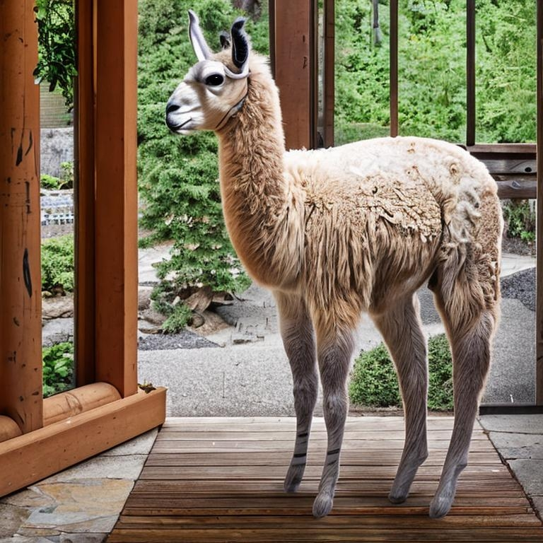

# 🐪 camelid-porch 🦙 



## 📚 Libraries used 📚

* Llama.cpp
* Langchain
* llama-cpp-python
* BabyAGI
* faiss

## 🚜 Models 🚜

* Alpaca (7B, gpt4-x-alpaca-30b-ggml-q4_1)
* Vicuna (ggml-vicuna-7b-q4_0, ggml-vicuna-13b-1.1-q4_2)
* Dolly (WIP) (dolly-v2-3b, dolly-v2-12b-q4_0)
* StableLM (WIP)

## Setup

### Install requirements:

```
pip install -r requirements.txt
```

### Run it:
```
python3 main.py --path ./data --prompt "Tell me if an API key required to use camelid-porch"
```

```
Answer: No it is not necessary
```

## Commands

### Index a list of urls from a file:

```
python3 main.py --urls urls.txt
```

### Index a list of files from a directory:

```
python3 main.py --path ./data
```

### Prompt after indexing:

```
python3 main.py --path ./data --prompt "Where was this alpaca born?"
```

### Save to index.json after indexing:

```
python3 main.py --save index.json
```


### Chain prompts 
From https://github.com/ai8hyf/babyagi/commit/6fcd528a92c80846dbb351f2b7babdd50c38709d

```
python3 babyagi.py --prompt "Create a coffee blog"
```

### Configure model

```
--model
```

## Related links
* [Gist adding Python LLM Class](https://gist.github.com/lukestanley/6517823485f88a40a09979c1a19561ce_)
* [Langchain issue [#1777]](https://github.com/hwchase17/langchain/issues/1777)
* [llama confusion](https://github.com/yoheinakajima/babyagi/issues/130)
